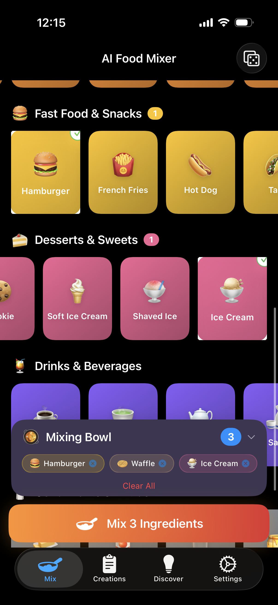
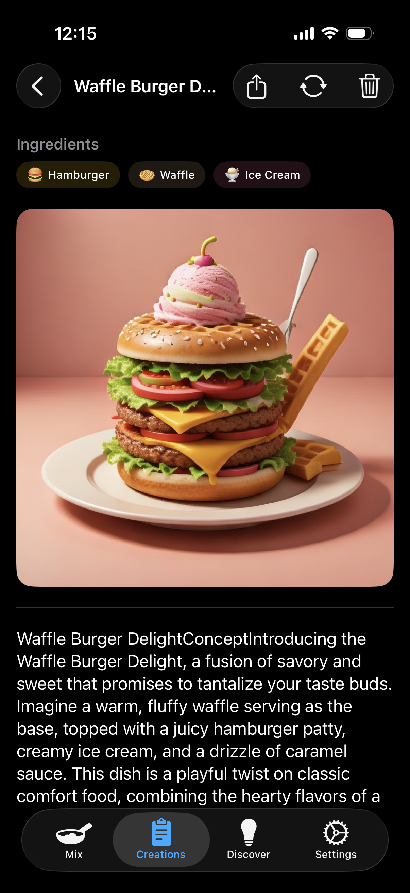

# AI Food Mixer

AI Food Mixer is an iOS app that transforms food creativity into a tap-driven mixing experience. Select food emoji "ingredient" cards from curated categories, and the app generates a creative new food concept — complete with a name, layered structure, flavor profile, and serving suggestion — using Apple's on-device Foundation Model.

**Invent impossible food mashups without ever opening the keyboard.**

## Screenshots

<p align="center">
  
  &nbsp;&nbsp;
  
</p>

## Features

- **Ingredient Selection** — Browse 120+ food emoji cards across 10 culinary categories. Tap to add ingredients to your Mixing Bowl.
- **Food Concept Generation** — Combine selected ingredients via the on-device Foundation Model to produce a creative food concept with streaming Markdown output.
- **Image Generation** — Automatically generates a visual representation of your food concept using Image Playground.
- **Project Management** — Save, view, and manage generated creations. Remix any saved project by loading its ingredients back into the Mix tab.
- **Discover Gallery** — Browse 5 curated food mashup examples (Curry Lava Pizza Cake, Sushi Taco Fusion, and more) and remix them as starting points.
- **Surprise Me** — Randomly select one ingredient per category for instant inspiration.
- **Custom Ingredients & Categories** — Create your own ingredients and categories beyond the 120 built-in defaults.
- **System Prompt Customisation** — Edit or create system prompts to control food concept generation style and structure.
- **Share & Export** — Export food concepts as Markdown or plain text via the iOS Share Sheet.

## Requirements

- iOS 26+
- Xcode 26+
- Apple Silicon device (for Foundation Model and Image Playground features)

## Architecture

The app follows MVVM with SwiftUI and SwiftData:

```
AI Food Mixer/
├── Models/          Data types and SwiftData persistence models
├── Data/            Static default content (ingredients, categories, prompts)
├── Services/        Business logic (generation, export, haptics)
├── ViewModels/      UI state management and coordination
├── Views/           SwiftUI views organised by tab
└── Extensions/      Swift type extensions
```

Key technical decisions:

- **On-device AI** — All inference runs through the FoundationModels framework. No data leaves the device.
- **Image Playground** — Food concept images are generated on-device using the ImagePlayground framework.
- **Value types for defaults** — Built-in ingredients and categories are static arrays, not SwiftData models, avoiding schema migration complexity.
- **JSON blob storage** — Projects store ingredients as encoded JSON, making them fully self-contained and portable.
- **@Observable** — All view models use the `@Observable` macro for cleaner SwiftUI integration.

## Food Tuner CLI

A companion macOS CLI tool for testing and iterating on system prompts and ingredient categories. Reuses the app's model and data files directly via Swift Package Manager.

```bash
# Build (requires macOS 26+)
swift build --product food-tuner

# List categories and ingredients
swift run food-tuner list-categories
swift run food-tuner list-ingredients --category fruits

# Build the full prompt pair (system + user) from ingredient IDs
swift run food-tuner build-prompt --ids fruits_banana,desserts_shortcake,preparedDishes_curryRice --json

# Generate a food concept using the on-device Foundation Model
swift run food-tuner generate --ids fruits_banana,desserts_shortcake,preparedDishes_curryRice
swift run food-tuner generate --ids preparedDishes_pizza,preparedDishes_sushi --output my_concept.md

# Test with a custom system prompt
swift run food-tuner generate --ids fruits_strawberry --system-prompt-file custom_prompt.txt

# Add custom categories and ingredients
swift run food-tuner add-category --id spices --name Spices --emoji 🌶️
swift run food-tuner add-ingredient --id spices_paprika --label Paprika --emoji 🫙 --category spices
```

All commands support `--json` for machine-readable output. Run `swift run food-tuner --help` for full usage.

## License

All rights reserved.
